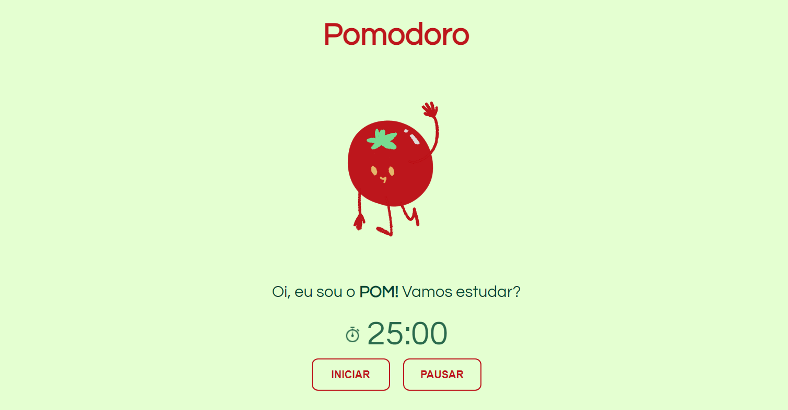
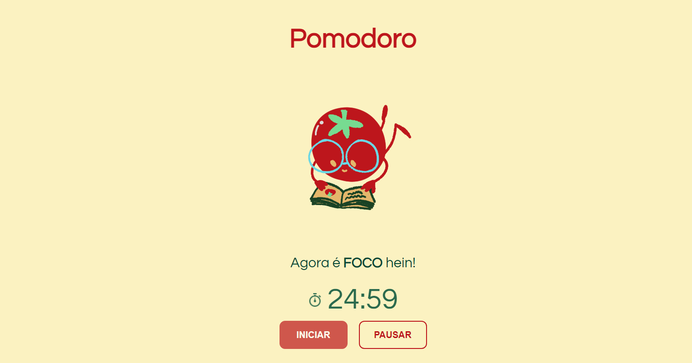
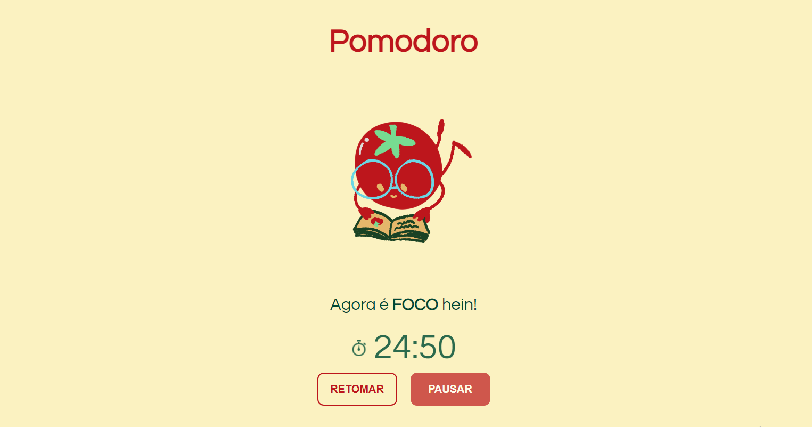
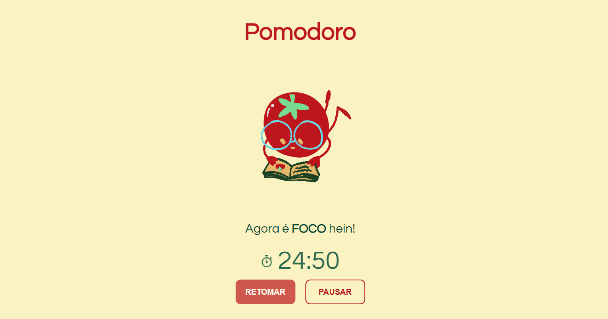
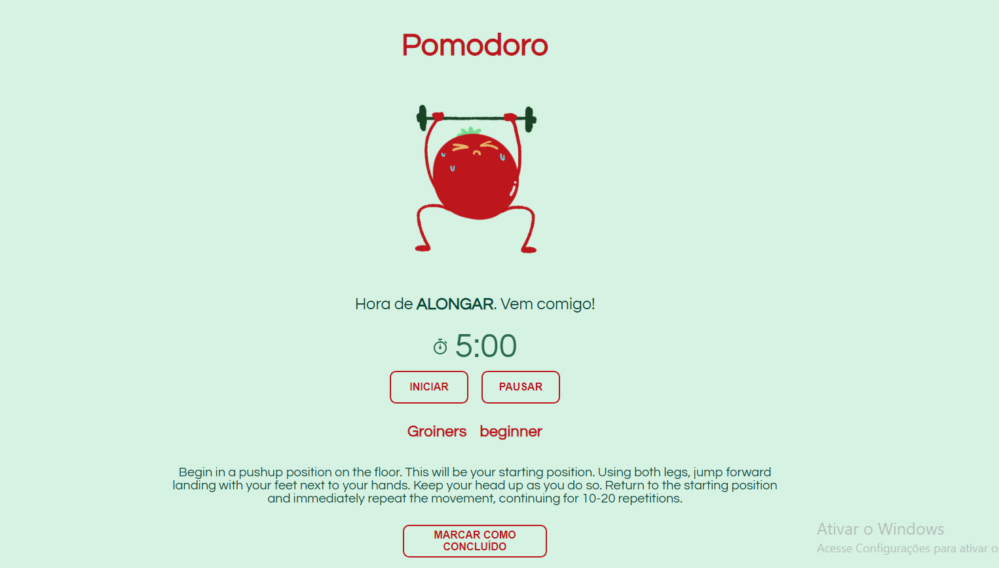
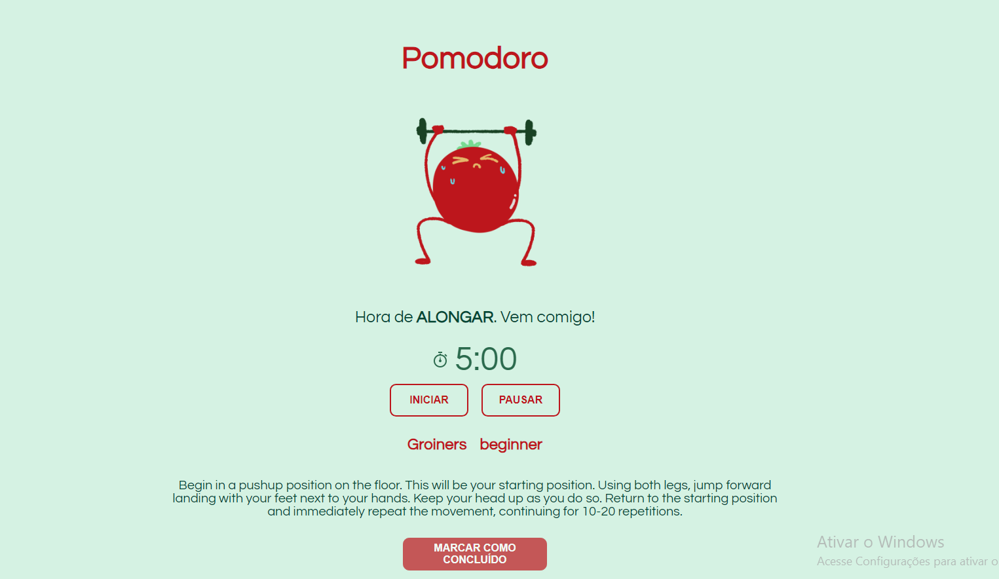
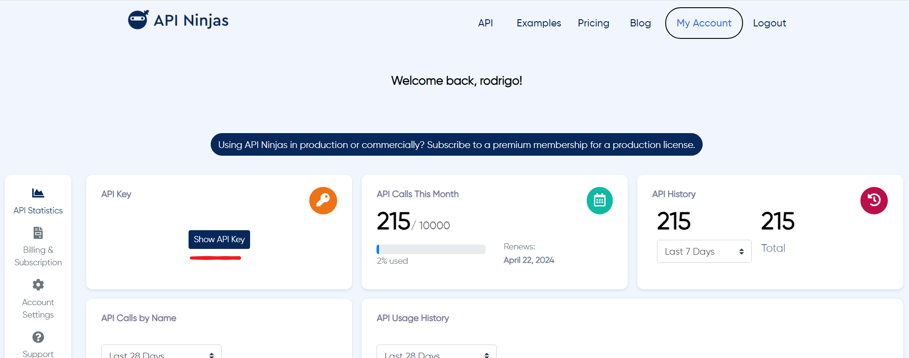
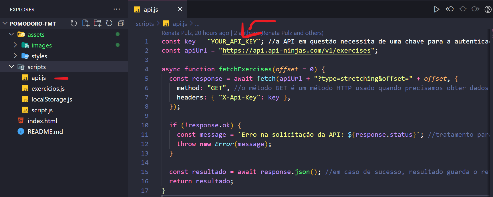

# Pomodoro Timer

## Descrição:

Projeto realizado como exercício da semana [09] da trilha **Futuro Dev** (turma ECO) do curso **Floripa Mais Tec**.

### Objetivo:

Desenvolver um **Pomodoro** voltado para pessoas que trabalham sentadas, onde ao final de cada período de 25 minutos o programa sorteia um exercício de alongamento proveniente de uma API gratuita.
O intuito é que o usuário realize o alongamento sugerido nos 5 minutos de 
descanso do **Pomodoro**.

## Desenvolvedores:
Deyse Aiala: https://github.com/deyseaiala  
Luiza Kasper: https://github.com/kasperdiem  
Renata Pulz: https://github.com/renatapulz  
Rodrigo Soares: https://github.com/rodrigoeduss  
Vanessa Hasckel: https://github.com/vhasckel

## Tecnologias utilizadas:

        

## Funcionalidades:

**Botão INICIAR** - Tem a função de disparar o cronômetro regressivo de 25 minutos.
 
 

**Botão PAUSAR** - Tem a função de interrompar/pausar o cronômetro.
 
 

**Botão RETOMAR** - Tem a função de reiniciar a contagem a partir do tempo interrompido.
 
 

## Hora de alongar

Nesta etapa de intervalo dos estudos, um exercício de alongamento é exibido na tela para que o usuário realize. Os botões INICIAR, PAUSAR e RETOMAR continuam com as mesmas ações das telas anteriores.  
--- *Não era tarefa da atividade traduzir o texto enviado pela API*.
 
 

**Botão MARCAR COMO CONCLUÍDO** - Tem a função de salvar o exercício como concluído e no próximo intervalo outra atividade será exibida.
 
 

## API Utilizada:
#### API NINJAS
Link:   https://api-ninjas.com/ 

## Instruções:
Para rodar o projeto é necessário logar no site API Ninjas e copiar a chave fornecida: 
 

Logo após, basta colar a chave no arquivo api.js
 

